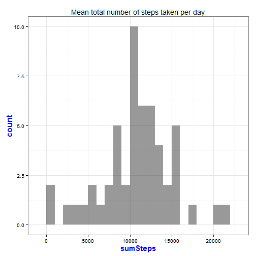
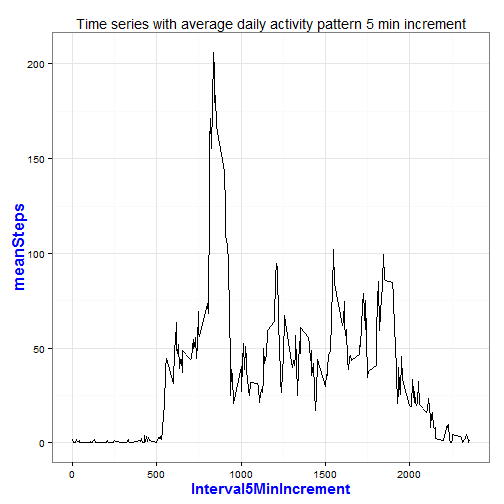
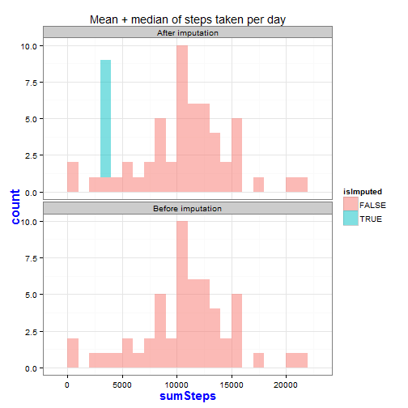
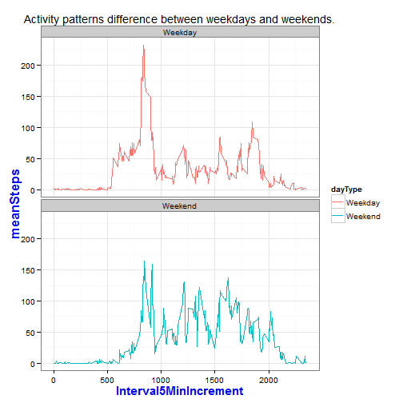
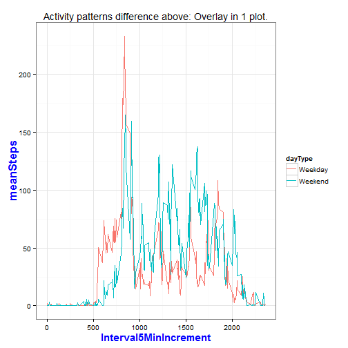

Peer Assessment 1
=================

Peer assessment 1 assignment for Coursera course [Reproducible Research](Reproducible Research).

## Introduction  

It is now possible to collect a large amount of data about personal
movement using activity monitoring devices such as a
[Fitbit](http://www.fitbit.com), [Nike
Fuelband](http://www.nike.com/us/en_us/c/nikeplus-fuelband), or
[Jawbone Up](https://jawbone.com/up). These type of devices are part of
the "quantified self" movement -- a group of enthusiasts who take
measurements about themselves regularly to improve their health, to
find patterns in their behavior, or because they are tech geeks. But
these data remain under-utilized both because the raw data are hard to
obtain and there is a lack of statistical methods and software for
processing and interpreting the data.

This assignment makes use of data from a personal activity monitoring
device. This device collects data at 5 minute intervals through out the
day. The data consists of two months of data from an anonymous
individual collected during the months of October and November, 2012
and include the number of steps taken in 5 minute intervals each day.

## Data  

The data for this assignment can be downloaded from the course web
site:

* __Dataset__: [Activity monitoring data](https://d396qusza40orc.cloudfront.net/repdata%2Fdata%2Factivity.zip) [52K]

The variables included in this dataset are:

* **steps**: Number of steps taking in a 5-minute interval (missing
values are coded as `NA`)

* **date**: The date on which the measurement was taken in YYYY-MM-DD
format

* **Interval5MinIncrement**: Identifier for the 5-minute interval in which
measurement was taken

The dataset is stored in a comma-separated-value (CSV) file and there
are a total of 17,568 observations in this
dataset.

## Assignment  

This assignment will be described in multiple parts. You will need to
write a report that answers the questions detailed below. Ultimately,
you will need to complete the entire assignment in a **single R
markdown** document that can be processed by **knitr** and be
transformed into an HTML file.

Throughout your report make sure you always include the code that you
used to generate the output you present. When writing code chunks in
the R markdown document, always use `echo = TRUE` so that someone else
will be able to read the code. **This assignment will be evaluated via
peer assessment so it is essential that your peer evaluators be able
to review the code for your analysis**.

For the plotting aspects of this assignment, feel free to use any
plotting system in R (i.e., base, lattice, ggplot2)

Fork/clone the [GitHub repository created for this
assignment](http://github.com/rdpeng/RepData_PeerAssessment1). You
will submit this assignment by pushing your completed files into your
forked repository on GitHub. The assignment submission will consist of
the URL to your GitHub repository and the SHA-1 commit ID for your
repository state.

NOTE: The GitHub repository also contains the dataset for the
assignment so you do not have to download the data separately.

## Suggested answer to assignment questions in the following steps:  

### **Step 1.** Loading and preprocessing the data

Show any code that is needed to:

__Step 1.1__ Load the data (i.e. `read.csv()`)**-- DONE **  
Setup work enviroment: Load required R packages for process + unzip data file.

```r
setwd("C:/Anthony_Wynn/Docs/R/R_Lang/hopkins/ReproducipleResearch/peerAss1")
#install.packages("SeqKNN")
packages <- c("data.table", "ggplot2", "xtable", "VIM", "knitr")
sapply(packages, require, character.only=TRUE, quietly=TRUE)
```

```
## data.table    ggplot2     xtable        VIM      knitr 
##       TRUE       TRUE       TRUE       TRUE       TRUE
```


Use `data.table` for analysis instead of `DF` for better performance [`data.table`](http://cran.r-project.org/web/packages/data.table/index.html) package.

```r
unzip("activity.zip", files=NULL, exdir=getwd(), overwrite=TRUE)
dtActvMonData <- read.csv(file.path(getwd(), "activity.csv"))
dtActvMonData <- data.table(dtActvMonData)
# Rename the "interval" column for easier to understand.   
dtActvMonData <- setnames(dtActvMonData,"interval","Interval5MinIncrement")
```
 
__Step 1.2__ Process/transform the data (if necessary) into a format suitable for your analysis -- **DONE**  


```r
#transform `date` variable to a date class.
dtActvMonData <- dtActvMonData[, date := as.Date(date)]
```

### Step 2.0 What is mean total number of steps taken per day?

For this part of the assignment, you can ignore the missing values in
the dataset. When we calculate the median and the mean in the Step 2.2 we will exclude na (`na.rm = TRUE`)

__Step 2.1__ Make a histogram of the total number of steps taken each day**-- DONE **  

```r
#Aggregate the number of steps taken each day & save in new DT
dtDailySteps <- dtActvMonData[, list(sumSteps = sum(steps)), date]
head(dtDailySteps)
```

```
##          date sumSteps
## 1: 2012-10-01       NA
## 2: 2012-10-02      126
## 3: 2012-10-03    11352
## 4: 2012-10-04    12116
## 5: 2012-10-05    13294
## 6: 2012-10-06    15420
```

```r
graph <- ggplot(dtDailySteps, aes(x=sumSteps))+geom_histogram(alpha=1/2, binwidth=1000)+ggtitle("Mean total number of steps taken per day")
# set Black-and-white theme
graph + theme_bw() + theme(axis.title.x = element_text(colour="blue", size=15, face="bold")) + theme(axis.title.y = element_text(colour="blue", size=17, face="bold"))
```

 

__Step 2.2__ Calculate and report the **mean** and **median** total number of steps taken per day. Calculate the mean and median total number of steps taken per day **before imputing**.**-- DONE **  


```r
#Aggregate the number of steps taken each day. Days with missing values (`NA`) will have `NA` when aggregated.
aggResult <- dtDailySteps[, list(n = .N, nValid = sum(!is.na(sumSteps)), mean = mean(sumSteps, na.rm=TRUE), median = median(sumSteps, na.rm=TRUE))]
#TAble below is the answer for mean and median value.
print(xtable(aggResult), type="html", include.rownames=FALSE)
```

<!-- html table generated in R 3.1.0 by xtable 1.7-3 package -->
<!-- Sun Jul 20 13:11:51 2014 -->
<TABLE border=1>
<TR> <TH> n </TH> <TH> nValid </TH> <TH> mean </TH> <TH> median </TH>  </TR>
  <TR> <TD align="right">  61 </TD> <TD align="right">  53 </TD> <TD align="right"> 10766.19 </TD> <TD align="right"> 10765 </TD> </TR>
   </TABLE>

```r
#Copy the data table `dtDailySteps` before imputation to be used later. Add new coln status
dtDailySteps <- dtDailySteps[, status := "Before imputation"]
dtDailyStepsB4Imptt <- dtDailySteps
```

###Step 3.0 What is the average daily activity pattern?  

__Step 3.1__ Make a time series plot (i.e. `type = "l"`) of the 5-minute interval (x-axis) and the average number of steps taken, averaged across all days (y-axis)**-- DONE **  
__Step 3.2__ Which 5-minute interval, on average across all the days in the dataset, contains the maximum number of steps? **-- DONE **  
Aggregate the average number of steps taken by 5-minute interval.


```r
dtIntervals<-dtActvMonData[, list(meanSteps = mean(steps, na.rm=TRUE)), Interval5MinIncrement]
```

Plot a time series of the 5-minute interval and the average number of steps taken across all days.


```r
graph<-ggplot(dtIntervals, aes(x=Interval5MinIncrement, y=meanSteps))+
        geom_line()+ggtitle("Time series with average daily activity pattern 5 min increment")
# set Black-and-white theme
graph + theme_bw() + theme(axis.title.x = element_text(colour="blue", size=15, face="bold")) + theme(axis.title.y = element_text(colour="blue", size=17, face="bold"))
```

 


### Step 4.0 Imputing missing values  

__Note__: that there are a number of days/intervals where there are missing
values (coded as `NA`). The presence of missing days may introduce
bias into some calculations or summaries of the data.

Step 4.1 Calculate and report the total number of missing values in the dataset (i.e. the total number of rows with `NA`s)**-- DONE **  

```r
dtActvMonData <- dtActvMonData[, isStepsMissing := is.na(steps)]
aggResult <- dtActvMonData[, .N, isStepsMissing]
print(xtable(aggResult), type="html", include.rownames=FALSE)
```

<!-- html table generated in R 3.1.0 by xtable 1.7-3 package -->
<!-- Sun Jul 20 13:11:51 2014 -->
<TABLE border=1>
<TR> <TH> isStepsMissing </TH> <TH> N </TH>  </TR>
  <TR> <TD> TRUE </TD> <TD align="right"> 2304 </TD> </TR>
  <TR> <TD> FALSE </TD> <TD align="right"> 15264 </TD> </TR>
   </TABLE>

```r
summary(dtActvMonData)
```

     steps            date            Interval5MinIncrement
 Min.   :  0.0   Min.   :2012-10-01   Min.   :   0         
 1st Qu.:  0.0   1st Qu.:2012-10-16   1st Qu.: 589         
 Median :  0.0   Median :2012-10-31   Median :1178         
 Mean   : 37.4   Mean   :2012-10-31   Mean   :1178         
 3rd Qu.: 12.0   3rd Qu.:2012-11-15   3rd Qu.:1766         
 Max.   :806.0   Max.   :2012-11-30   Max.   :2355         
 NA's   :2304                                              
 isStepsMissing 
 Mode :logical  
 FALSE:15264    
 TRUE :2304     
 NA's :0        
                
                
                

__Step 4.2__ Devise a strategy for filling in all of the missing values in the dataset. The strategy does not need to be sophisticated. For example, you could use the mean/median for that day, or the mean for that 5-minute interval, etc.

Use the [VIM](http://cran.r-project.org/web/packages/VIM/index.html) package to impute missing values of the `steps` variable.
Use k-Nearest Neighbour Imputation.**-- DONE **  
k-Nearest Neighbour Imputation based on a variation of the Gower Distance for numerical, categorical, ordered and semi-continous variables. 


```r
dtActvMonData <- kNN(dtActvMonData, metric = NULL,
    k = 5, dist_var = colnames(dtActvMonData), weights = NULL,
    numFun = median, catFun = maxCat, makeNA = NULL,
    NAcond = NULL, impNA = TRUE, donorcond = NULL,
    mixed = vector(), mixed.constant = NULL, trace = FALSE,
    imp_var = TRUE, imp_suffix = "imp", addRandom = FALSE)
```

```
## Time difference of -4.649 secs
```
The `kNN` function returns a dataset with all `NA`s replaced.
So the `steps` variable now contains imputed values replacing the `NA`s.


__Step 4.3__ Create a new dataset that is equal to the original dataset but with the missing data filled in.**-- DONE **  
Verify that there are no missing values for `steps` after imputation.


```r
aggResult <- dtActvMonData[, .N, list(isMissing = is.na(steps))]
print(xtable(aggResult), type="html", include.rownames=FALSE)
```

<!-- html table generated in R 3.1.0 by xtable 1.7-3 package -->
<!-- Sun Jul 20 13:11:56 2014 -->
<TABLE border=1>
<TR> <TH> isMissing </TH> <TH> N </TH>  </TR>
  <TR> <TD> FALSE </TD> <TD align="right"> 17568 </TD> </TR>
   </TABLE>

Verify that missingness is complete for an entire day.
Show all days with at least 1 missing value for the `steps` variable.
Calculate the proportion of records with missing values for each such day.
All proportions are 100%.


```r
dtMissingValue <- dtActvMonData[, list(countMissing = sum(isStepsMissing), countRecords = .N, propMissing = sum(isStepsMissing / .N)), date]
dtMissingValue[countMissing > 0]
```

```
##          date countMissing countRecords propMissing
## 1: 2012-10-01          288          288           1
## 2: 2012-10-08          288          288           1
## 3: 2012-11-01          288          288           1
## 4: 2012-11-04          288          288           1
## 5: 2012-11-09          288          288           1
## 6: 2012-11-10          288          288           1
## 7: 2012-11-14          288          288           1
## 8: 2012-11-30          288          288           1
```
#### After imputation of missing values

Aggregate the number of steps taken each day.


```r
dtDailySteps <- dtActvMonData[, list(sumSteps = sum(steps), isImputed = sum(steps_imp) > 0), date]
head(dtDailySteps)
```

```
##          date sumSteps isImputed
## 1: 2012-10-01     3036      TRUE
## 2: 2012-10-02      126     FALSE
## 3: 2012-10-03    11352     FALSE
## 4: 2012-10-04    12116     FALSE
## 5: 2012-10-05    13294     FALSE
## 6: 2012-10-06    15420     FALSE
```

__Step 4.4__ Make a histogram of the total number of steps taken each day and Calculate and report the **mean** and **median** total number of steps taken per day. Do these values differ from the estimates from the first part of the assignment? What is the impact of imputing missing data on the estimates of the total daily number of steps?
Plot a histogram of the total number of steps taken each day **after imputing** and compare with the histogram **before imputing**.**-- DONE **  
Need to add an `isImputed` column to `dtDailyStepsB4Imptt` to make `rbind` work.


```r
dtDailySteps <- dtDailySteps[, status := "After imputation"]

dtDailyStepsB4Imptt <- dtDailyStepsB4Imptt[, isImputed := FALSE]

dtDailySteps <- rbind(dtDailySteps, dtDailyStepsB4Imptt, use.names=TRUE)

graph<-ggplot(dtDailySteps, aes(x=sumSteps, fill=isImputed)) +
geom_histogram(alpha=1/2, binwidth=1000)+facet_wrap(~ status, nrow=2)+
  theme(legend.position="bottom")+ggtitle("Mean + median of steps taken per day")

# set Black-and-white theme
graph + theme_bw() + theme(axis.title.x = element_text(colour="blue", size=15, face="bold")) + theme(axis.title.y = element_text(colour="blue", size=17, face="bold"))
```

 

Calculate the mean and median total number of steps taken per day **after imputing**.


```r
aggResult <- dtDailySteps[, list(n = .N, nValid = sum(!is.na(sumSteps)), mean = mean(sumSteps, na.rm=TRUE), median = median(sumSteps, na.rm=TRUE)), status]
print(xtable(aggResult), type="html", include.rownames=FALSE)
```

<!-- html table generated in R 3.1.0 by xtable 1.7-3 package -->
<!-- Sun Jul 20 13:11:56 2014 -->
<TABLE border=1>
<TR> <TH> status </TH> <TH> n </TH> <TH> nValid </TH> <TH> mean </TH> <TH> median </TH>  </TR>
  <TR> <TD> After imputation </TD> <TD align="right">  61 </TD> <TD align="right">  61 </TD> <TD align="right"> 9752.39 </TD> <TD align="right"> 10395.00 </TD> </TR>
  <TR> <TD> Before imputation </TD> <TD align="right">  61 </TD> <TD align="right">  53 </TD> <TD align="right"> 10766.19 </TD> <TD align="right"> 10765.00 </TD> </TR>
   </TABLE>

The median of the imputed values is the same as the original values where missing values were not imputed.
However, the mean of the imputed values is **less than** the original values.
The overall impact of the imputed values is to **lower** the estimates of the number of steps taken each day.

###Step 5.0 Are there differences in activity patterns between weekdays and weekends?
For this part the `weekdays()` function may be of some help here. Use the dataset with the filled-in missing values for this part.

Step 5.1 Create a new factor variable in the dataset with two levels -- "weekday" and "weekend" indicating whether a given date is a weekday or weekend day.
Create a new factor variable in the dataset with two levels -- "weekday" and "weekend" indicating whether a given date is a weekday or weekend day.**-- DONE **  
Use this solution to [collapse the factor values](http://stackoverflow.com/a/9053619) for day of week.
Verify that `dayOfWeek` and `dayType` are factor class variables.


```r
levels <- c("Sunday", "Monday", "Tuesday", "Wednesday", "Thursday", "Friday", "Saturday")
newLevels <- c("Weekend", rep("Weekday", 5), "Weekend")
dtActvMonData <- dtActvMonData[, dayOfWeek := factor(weekdays(date), levels=levels)]
dtActvMonData <- dtActvMonData[, dayType := factor(newLevels[dayOfWeek])]
dtActvMonData[, .N, list(dayType, dayOfWeek)]
```

```
##    dayType dayOfWeek    N
## 1: Weekday    Monday 2592
## 2: Weekday   Tuesday 2592
## 3: Weekday Wednesday 2592
## 4: Weekday  Thursday 2592
## 5: Weekday    Friday 2592
## 6: Weekend  Saturday 2304
## 7: Weekend    Sunday 2304
```

```r
message(sprintf("Is dayOfWeek a factor? %s. Is dayType a factor? %s", is.factor(dtActvMonData$dayOfWeek), is.factor(dtActvMonData$dayType)))
```

```
## Is dayOfWeek a factor? TRUE. Is dayType a factor? TRUE
```

Aggregate the average number of steps taken by 5-minute interval.
Use the imputed values in the `steps` variable.


```r
dtIntervals<-dtActvMonData[, list(meanSteps=mean(steps, na.rm=TRUE)), list(dayType, Interval5MinIncrement)]
```
__Step 5.2__ Make a panel plot containing a time series plot (i.e. `type = "l"`) of the 5-minute interval (x-axis) and the average number of steps taken, averaged across all weekday days or weekend days (y-axis). The plot should look something like the following, which was creating using **simulated data**:**-- DONE **  

Plot two time series (one for weekdays and the other for weekends) of the 5-minute intervals and average number of steps taken (imputed values).


```r
graph<-ggplot(dtIntervals, aes(x=Interval5MinIncrement, y=meanSteps, color=dayType))+geom_line()+ facet_wrap(~ dayType, nrow=2)+theme(legend.position="none")+ggtitle("Activity patterns difference between weekdays and weekends.")
# set Black-and-white theme
graph + theme_bw() + theme(axis.title.x = element_text(colour="blue", size=15, face="bold")) + theme(axis.title.y = element_text(colour="blue", size=17, face="bold"))
```

 

Another angle of seeing data differences by overlay the time series on a single plot instead of using a panel plot.


```r
graph<-ggplot(dtIntervals, aes(x=Interval5MinIncrement, y=meanSteps, color=dayType)) +geom_line()+theme(legend.position="bottom")+ggtitle("Activity patterns difference above: Overlay in 1 plot.")
# set Black-and-white theme
graph + theme_bw() + theme(axis.title.x = element_text(colour="blue", size=15, face="bold")) + theme(axis.title.y = element_text(colour="blue", size=17, face="bold"))
```

 
